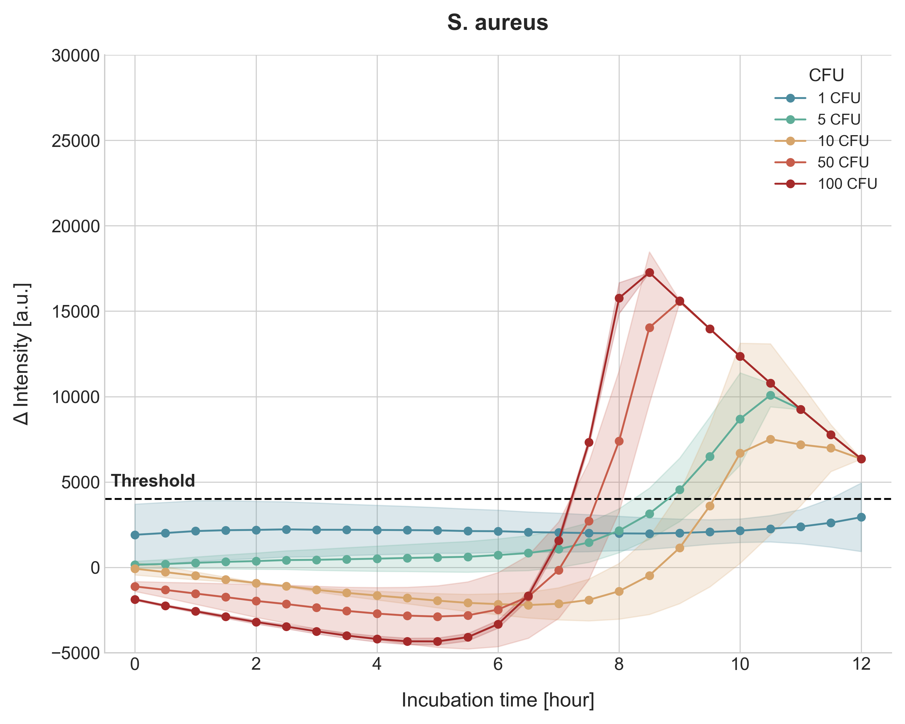

# NEST Fluorescence Analysis Workflow

This repository provides a complete Python-based workflow for analyzing time-lapse fluorescence microscopy images to perform a rapid sterility test, as described in the paper "One-day rapid sterility test for human-derived biopharmaceuticals".

The workflow processes raw `.tif` images, extracts fluorescence intensity data, calculates differential intensity against controls, and generates publication-quality plots.

## Project Overview

The core methodology involves three main steps, each handled by a dedicated script:

1.  **Circular Cropping**: Isolates the circular well area from each raw image to ensure consistent analysis and remove background noise.
2.  **Intensity Analysis**: Calculates a "robust mean" intensity for each cropped image and compiles the data into a structured CSV file.
3.  **Plot Generation**: Uses the CSV data to calculate differential intensity (Δ Intensity) and generates a time-series plot similar to the one in the publication.



---

## Prerequisites

-   Python 3.8+
-   Git

The following Python libraries are required:
-   `opencv-python`
-   `numpy`
-   `pandas`
-   `matplotlib`
-   `seaborn`

## Installation

1.  **Clone the repository:**
    ```bash
    git clone https://github.com/phisoart/NEST.git
    cd NEST
    ```

2.  **Install dependencies:**
    ```bash
    pip install -r requirements.txt
    ```
    *(Note: A `requirements.txt` file can be created with `pip freeze > requirements.txt` after installing the packages above.)*

3.  **Place your data:**
    -   Put your raw `.tif` image files into the `img/` directory.
    -   The filenames are expected to follow a pattern like `T23_SA_1_3.tif` (for samples) or `T01_Ctr_1.tif` (for controls).

---

## Usage - Step-by-Step Workflow

Execute the scripts in the following order. You will be prompted for confirmation before processing all files.

### Step 1: Crop Images

This script crops the center circular area from all images in `img/` and saves them to `img/circle/`.

```bash
python circle_crop.py
```
-   **Input**: `img/*.tif`
-   **Output**: `img/circle/*.tif` (cropped images)

### Step 2: Analyze Fluorescence Intensity

This script analyzes the cropped images, calculates the robust mean intensity for each, and saves the structured data to a CSV file.

```bash
python analyze_fluorescence.py
```
-   **Input**: `img/circle/*.tif`
-   **Output**: `fluorescence_analysis.csv`

The output CSV will have the following columns:
`filename`, `time_str`, `sample_type`, `cfu`, `replicate`, `mean_intensity`

### Step 3: Generate Plot

This script reads the CSV file, calculates the differential intensity, and generates the final plot in multiple formats (PNG, SVG, PDF).

```bash
python plot_fluorescence.py
```
-   **Input**: `fluorescence_analysis.csv`
-   **Outputs**:
    -   `fluorescence_plot.png` (for general use)
    -   `fluorescence_plot.svg` (vector format, editable in Illustrator)
    -   `fluorescence_plot.pdf` (vector format, for printing and editing)

---

## Core Algorithms

### Robust Mean Intensity Calculation
To ensure stable and reliable measurements, the analysis uses a robust mean calculation:
1.  **Isolate ROI**: Pixels outside the cropped circle (value = 0) are excluded.
2.  **Denoise**: The top and bottom 25% of pixel intensity values are excluded to remove outliers and sensor noise.
3.  **Average**: The mean is calculated from the remaining middle 50% of the pixel values.

### Differential Intensity (Δ Intensity)
To correct for background fluorescence from the culture medium, the final plotted value is the differential intensity, calculated as:

\[ \Delta \text{Intensity} = (\text{Mean Intensity of SA Well}) - (\text{Mean Intensity of Ctr Well at same time point}) \]

---

## Data Availability

**Note**: Due to file size limitations, only sample analysis scripts are included in this repository.

For access to the complete image dataset used in the paper, please contact the corresponding authors as listed in the publication.

## License

This project is licensed under the MIT License.